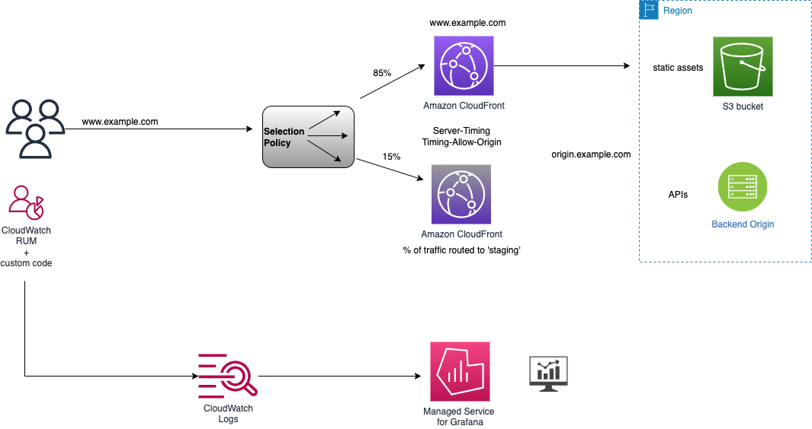

# CloudFront Real User Monitoring

## Use cases:

1. monitor metrics like Cache Hit Ratio, Time to First Byte, Time to Last Byte, Page Load time, TCP/TLS connect time

1. compare performance metrics between CDNs, between origin vs CloudFront.

1. look at deeper metrics by content types (images, CSS, JS etc) for a particular CF distribution..

## AWS Services used:

CloudFront, CloudWatch RUM, CloudWatch Logs, Amazon Grafana, AWS Identity Center (AWS SSO)

## Architecture 




## Steps to build

1. Clone and deploy the CDK solution in AWS Region where CloudWatch RUM is available.

1. Change into the directory and run below commands
    - `cd performance_monitoring/web-vitals`
    - `npm install`
    - `npm audit fix`
    - `npm run build`

1. Change into the directory and run below commands
    - `cd performance_monitoring/cdk`

1. Edit `deploy.sh` to update the deployment variables
```
# the AWS CLI profile name to be used.
export AWS_PROFILE=""
# 
export HOSTEDZONE_ID=''
export DOMAIN_NAME=''
export MONITOR_DOMAIN_PREFIX=""
# AWS Organization ID
export ORG_UNIT_ID=""
# Deploy staging configuration for Real User Measurements with Continuous Deployment feature 
export DEPLOY_STAGING="TRUE"
# Deploy config to support multi-cdn
export DEPLOY_MULTICDN="FALSE"
# AWS Region to deploy the solution
export CDK_DEPLOY_REGION=""
```
